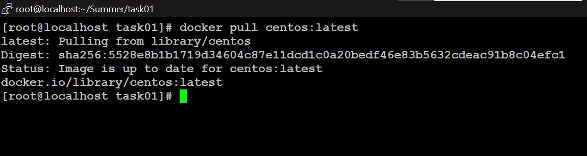

# *Creating and Deploying Machine Learning Model in Docker Container*

 ### Task Description

♦ Pull the Docker container image of CentOS image from DockerHub </br>
♦ Create a new container </br>
♦ Install the Python software on the top of docker container </br>
♦ In Container you need to copy/create machine learning model which you  have created in jupyter notebook </br>


> Step 1:

* Train the model in the jupyter notebook
* Save it in the localhost with the name salary.pk1


> Step 2:

Docker Installation
* Here we are doing the installation of the docker on top of rhel-8 so we first need to configure the yum repo from /etc/yum.repos.d/<repo_name>.repo

Content of Repo:
```
[docker]
baseurl = https://download.docker.com/linux/centos/7/x86_64/stable/
gpgcheck = 0
```

* Once the repo is configured we need to install the docker using command
`yum install docker-ce`

* For checking wheather Docker is install successfully or not we can use `docker info` command


> Step 3

Installation of docker image:
 command: `docker pull centos:latest`
 here we are getting the centos image of the latest version via this command

 

 > Step 4

 Launching a centos container using the Docker
 Command:
 `docker run -it --name salary-cont1 centos:latest`
* Here with the help of run command we can launch the container
* We want an interactive terminal so we used -it option
* With the help of --name we have gave name to the Container


> Step 5

Installing Necessary software like python and libraries in the Container

`yum install ncurses-6.1-7.20180224.el8.x86_64` //this will provide the clear Command</br>
`yum install python3` </br>
`pip3 install joblib` </br>
`pip3 install sklearn` //this will also install other dependent libraries </br>


> Step 6

Copy the created model from localhost into the Container
Command : `docker cp salary.pk1 salary-cont1:/root/.`


Note: We can also get the terminal of the container via `docker attach <container_name/container_id>`

> Step 7

Python Program (salary.py) in the container to run the model
```
import os
import joblib
mind=joblib.load('salary.pk1')
os.system("clear")
print("Welcome")
mind=joblib.load('salary.pk1')
i=float(input("Enter Years of Experience: "))
print("Predicted salary of the employee is ",mind.predict([[i]]))
```
Execution:
`python3 salary.py`


## Thankyou For Reading
Any query and suggestion are always welcome- [Gaurav Pagare](https://www.linkedin.com/in/gaurav-pagare-8b721a193/)
